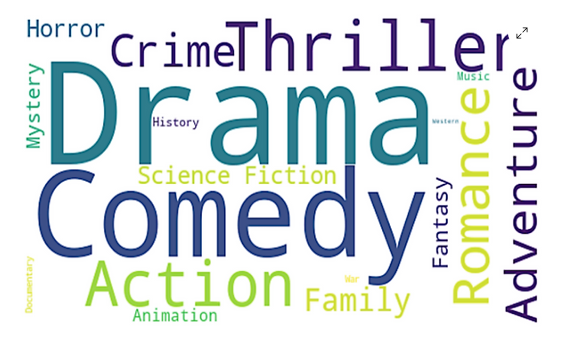

# Movie Genre Predictor



## Overview

Welcome to the Movie Genre Predictor project! This project aims to predict movie genres based on various features extracted from movie data obtained from The Movie Database (TMDB). The goal is to develop a machine learning model that accurately predicts the genre of a movie given its title, overview, and other relevant information.

## Business Problem

In the realm of movie production and recommendation systems, accurately predicting movie genres is crucial for various applications such as content recommendation, marketing strategies, and audience targeting. This project addresses the challenge of predicting movie genres effectively using machine learning techniques.


## Project Structure

The project is organized into the following key steps:

1. **Data Acquisition:**
   - Obtain movie data from The Movie Database (TMDB)using appropriate credentials.

2. **Data Preprocessing and Feature Engineering:**
   - Handle missing values.
   - Utilize natural language processing techniques to preprocess text data from movie titles, overviews, and other available information.
   - Extract relevant features such as word embeddings, TF-IDF vectors, or document embeddings.

3. **Model Training and Evaluation:**
   - Select appropriate NLP models or techniques for genre prediction, such as text classification algorithms or neural network architectures.
   - Train the models using the preprocessed text data.
   - Evaluate model performance using metrics suitable for text classification tasks, such as accuracy, precision, recall, or F1-score.


4. **User Interface Development:**
   - Develop a user-friendly interface for users to input movie information and get genre predictions.

5. **Dockerization and Deployment:**
   - Containerize the application using Docker for easy deployment.

### Prerequisites
- Python 3.x
- Jupyter Notebooks
- Docker

### Installation
```bash
pip install -r requirements.txt
